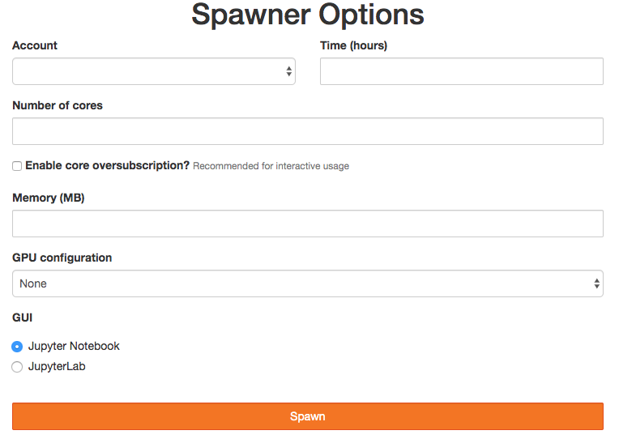

# slurmformspawner
JupyterHub SlurmSpawner with a dynamic spawn form

## Requirements

- Python >= 3.7
- JupyterHub >= 4.0.0
- batchspawner>= 1.3.0
- cachetools
- traitlets

## Configuration

### SlurmFormSpawner

| Variable                          | Type    | Description                                     | Default |
| --------------------------------- | :------ | :---------------------------------------------- | ------- |
| `c.SlurmFormSpawner.disable_form`    | `CBool` | Disable the spawner input form, use only default values instead | `False` |
| `c.SlurmFormSpawner.error_template_path` | `Unicode` | Path to the Jinja2 template of the error page | `os.path.join(sys.prefix, 'share',  'slurmformspawner', 'templates', 'error.html')` |
| `c.SlurmFormSpawner.submit_template_path` | `Unicode` | Path to the Jinja2 template of the submit file | `os.path.join(sys.prefix, 'share', 'slurmformspawner', 'templates', 'submit.sh')` |
| `c.SlurmFormSpawner.ui_args` | `Dict` | Dictionary of dictionaries describing the UI options | refer to `ui_args` section |

#### `ui_args`

`ui_args` is a dictionary where the keys are labels that will be re-used in `SbatchForm.ui` and the values are dictionnaries describing how to launch the user interface.
Each option dictionary can have the following keys:
- `name` (required): string that will appear in the Spawner form
- `url`  (optional): url user is being redirected to after spawning the single-user server (refer to `JUPYTERHUB_DEFAULT_URL` documentation)
- `args` (optional): list of flags and options that will be appended to jupyter single-user command that should redirect to the UI.
- `modules` (optional): list of module names that needs to be loaded to make the user interface work

Here is an example of a dictionary that would configure Jupyter Notebook, a terminal and RStudio.
```
c.SlurmFormSpawner.ui_args = {
    'notebook' : {
        'name': 'Jupyter Notebook'
    },
    'terminal' : {
        'name': 'Terminal',
        'url': '/terminal/1'
    },
    'rstudio' : {
        'name': 'RStudio',
        'url': '/rstudio',
        'modules': ['rstudio-server']
    }
}
```

### SbatchForm

| Variable                          | Type    | Description                                     | Default |
| --------------------------------- | :------ | :---------------------------------------------- | ------- |
| `c.SbatchForm.runtime`  | `Dict({'max', 'min', 'step', 'lock', 'def'})` | Runtime widget parameters  | refer to `form.py`   |
| `c.SbatchForm.nprocs`  | `Dict({'max', 'min', 'step', 'lock', 'def'})` | Number of cores widget parameters | refer to `form.py` |
| `c.SbatchForm.memory`  | `Dict({'max', 'min', 'step', 'lock', 'def'})` | Memory (MB) widget parameters | refer to `form.py`    |
| `c.SbatchForm.oversubscribe`  | `Dict({'def', 'lock'})` | Oversubscribe widget parameters | refer to `form.py`  |
| `c.SbatchForm.gpus`  | `Dict({'def', 'choices', 'lock'})` | GPUs widget parameters | refer to `form.py`  |
| `c.SbatchForm.ui`  | `Dict({'def', 'choices', 'lock'})` | User interface widget parameters | refer to `form.py`  |
| `c.SbatchForm.reservation`  | `Dict({'def', 'choices', 'lock'})` | Reservation widget parameters | refer to `form.py`  |
| `c.SbatchForm.account`  | `Dict({'def', 'choices', 'lock'})` | Account widget parameters | refer to `form.py`  |
| `c.SbatchForm.partition` | `Dict({'def', 'choices', 'lock'})` | Slurm partition parameters | refer to `form.py` |
| `c.SbatchForm.form_template_path` | `Unicode` | Path to the Jinja2 template of the form | `os.path.join(sys.prefix, 'share',  'slurmformspawner', 'templates', 'form.html')` |

### SlurmAPI

| Variable                          | Type      | Description                                                       | Default |
| --------------------------------- | :-------- | :---------------------------------------------------------------- | ------- |
| `c.SlurmAPI.info_cache_ttl`       | `Integer` | Slurm sinfo output cache time-to-live (seconds)                   | 300     |
| `c.SlurmAPI.acct_cache_ttl`       | `Integer` | Slurm sacct output cache time-to-live (seconds)                   | 300     |
| `c.SlurmAPI.acct_cache_size`      | `Integer` | Slurm sacct output cache size (number of users)                   | 100     |
| `c.SlurmAPI.res_cache_ttl`        | `Integer` | Slurm scontrol (reservations) output cache time-to-live (seconds) | 300     |

## screenshot


